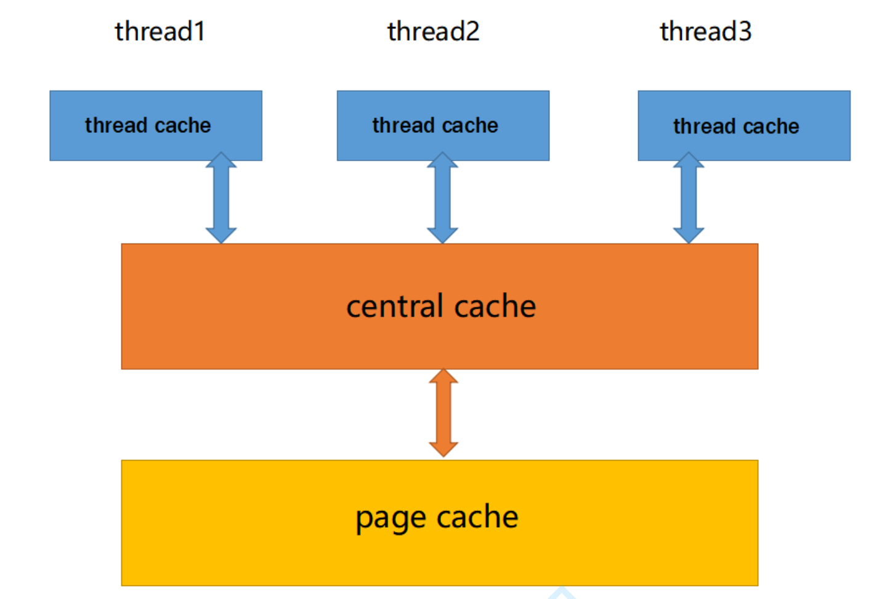

# Google-tcmalloc-simulation-implementation
谷歌开源项目tcmalloc高并发内存池学习和模拟实现

开题日期：20240504

- [Google-tcmalloc-simulation-implementation](#google-tcmalloc-simulation-implementation)
  - [前言](#前言)
  - [threadCache整体框架](#threadcache整体框架)
  - [开始写threadCache代码](#开始写threadcache代码)
  - [哈系桶的映射规则](#哈系桶的映射规则)
  - [threadCache的tls无锁访问](#threadcache的tls无锁访问)
  - [写tcfree的时候的一个遗留问题](#写tcfree的时候的一个遗留问题)

***

## 前言

当前项目是实现一个高并发的内存池，他的原型是google的一个开源项目tcmalloc，tcmalloc全称 Thread-Caching Malloc，即线程缓存的malloc，实现了高效的多线程内存管理，用于替代系统的内存分配相关的函数(malloc、free)。
这个项目是把tcmalloc最核心的框架简化后拿出来，模拟实现出一个自己的高并发内存池，目的就是学习tcamlloc的精华，这种方式有点类似我们之前学习STL容器的方式。但是相比STL容器部分，tcmalloc的代码量和复杂度上升了很多。

**另一方面tcmalloc是全球大厂google开源的，可以认为当时顶尖的C++高手写出来的，他的知名度也是非常高的，不少公司都在用它，Go语言直接用它做了自己内存分配器。所以很多程序员是熟悉这个项目的。**

现代很多的开发环境都是多核多线程，在申请内存的场景下，必然存在激烈的锁竞争问题。malloc本身其实已经很优秀，那么我们项目的原型tcmalloc就是在多线程高并发的场景下更胜一筹，所以这次我们实现的内存池需要考虑以下几方面的问题。
1. 性能问题。
2. 多线程环境下，锁竞争问题。 
3. 内存碎片问题。
   
**concurrent memory pool主要由以下3个部分构成：**
1. **thread cache:** 线程缓存是每个线程独有的，用于小于256KB的内存的分配，线程从这里申请内存不需要加锁，每个线程独享一个cache，这也就是这个并发线程池高效的地方。有几个线程，就会创建几个threadCache，每个线程都独享一个Cache。threadCache如果没有内存了，就去找centralCache
2. **central cache:** 中心缓存是所有线程所共享，thread cache是按需从central cache中获取的对象。central cache合适的时机回收thread cache中的对象，避免一个线程占用了太多的内存，而 其他线程的内存吃紧，达到内存分配在多个线程中更均衡的按需调度的目的。central cache是存在竞争的，**所以从这里取内存对象是需要加锁，首先这里用的是桶锁，其次只有threadCache的没有内存对象时才会找central cache，所以这里竞争不会很激烈。如果两个threadCache去不同的桶找内存，不用加锁！**
3. **page cache:** 页缓存是在central cache缓存上面的一层缓存，存储的内存是以页为单位存储及分配的，centralCache没有内存对象时，从pageCache分配出一定数量的page，并切割成定长大小的小块内存，分配给centralCache。当一个span的几个跨度页的对象都回收以后，pageCache 会回收centralCache满足条件的span对象，并且合并相邻的页，组成更大的页，缓解内存碎片的问题。



## threadCache整体框架

**一个重要概念：自由链表，就是把切好的小块内存链接起来，这一块内存的前4个字节是一个指针，指向链表的下一个地方。**

如果是定长内存池，那就是一个自由链表就行了，但是现在不是定长的。

那是不是1byte一个自由链表，2一个，3一个呢，这也太多了。

规定：小于256kb的找threadCache, 大于256kb后面再说。

所以如果如果1，2，3，4比特都挂一个链表，那就是二十几万个链表，太大了！

所以如图所示，我们就这么设计。


这是一种牺牲和妥协。

## 开始写threadCache代码

首先肯定要提供这两个接口，不用说的。

thread_cache.hpp
```cpp
class thread_cache {
private:
public:
    void* allocate(size_t size);
    void deallocate(void* ptr, size_t size);
};
```

当然我们发现，控制自由链表需要一个类，然后这个类不仅threadCache要用，其他上层的也要用，所以我们写在 common.hpp 里面去。

```cpp
class free_list {
private:
    void* __free_list_ptr;
public:
    void push(void* obj);
    void* pop();
};
```

push和pop实现很简单，头插和头删就行了。

```cpp
    void push(void* obj) {
        *(void**)obj = __free_list_ptr;
        __free_list_ptr = obj;
    }
```

这个`*(void**)obj`需要理解一下，因为我们不知道当前环境下一个指针是4个字节的还是8个字节的，所以要这样才能取到指针的大小。

然后我们也可以封装一下

```cpp
class free_list {
private:
    void* __free_list_ptr;

public:
    void push(void* obj) {
        assert(obj);
        __next_obj(obj) = __free_list_ptr;
        __free_list_ptr = obj;
    }
    void* pop() {
        assert(__free_list_ptr);
        void* obj = __free_list_ptr;
        __free_list_ptr = __next_obj(obj);
    }

private:
    static void*& __next_obj(void* obj) {
        return *(void**)obj;
    }
};
```

## 哈系桶的映射规则

我们可以写一个类，去计算对象大小的对齐映射规则。

tcmalloc里面的映射规则是很复杂的，这里我们进行简化了。

映射规则如下：

整体控制在最多10%左右的内碎片浪费 

| 申请的字节数量 | 对齐数 | 自由链表里对应的范围 |
|-------|-------|-------|
| [1,128] | 8byte对齐 | freelist[0,16) |
| [128+1,1024] | 16byte对齐 | freelist[16,72) |
| [1024+1,8*1024] | 128byte对齐 | freelist[72,128) |
| [8*1024+1,64*1024] | 1024byte对齐 | freelist[128,184) |
| [64*1024+1,256*1024] | 8*1024byte对齐 | freelist[184,208) |

**这样我们可以控制最多10%的内碎片浪费，如果你申请的多，那我就允许你浪费的稍微多一点，这个也是很合理的（这个规则是本项目设定的，tcmalloc的更加复杂）**

所以我们先确定跟谁对齐，然后再找对齐数。

common.hpp
```cpp
// 计算对象大小的对齐映射规则
class size_class {
public:
    static inline size_t __round_up(size_t bytes, size_t align_number) {
        return (((bytes) + align_number - 1) & ~(align_number - 1));
    }
    static inline size_t round_up(size_t size) {
        if (size <= 128)
            return __round_up(size, 8);
        else if (size <= 1024)
            return __round_up(size, 16);
        else if (size <= 8 * 1024)
            return __round_up(size, 128);
        else if (size <= 64 * 1024)
            return __round_up(size, 1024);
        else if (size <= 256 * 1024)
            return __round_up(size, 8 * 1024);
        else {
            assert(false);
            return -1;
        }
    }
};
```

如何理解这个代码。

```cpp
    size_t __round_up(size_t size, size_t align_number) {
        return (((bytes) + align_number - 1) & ~(align_number - 1));
    }
```

大佬想出来的，我们可以测试几个。

thread_cache.cc
```cpp
void* thread_cache::allocate(size_t size) {
    assert(size <= MAX_BITES);
    size_t align_size = size_class::round_up(size);
}
```
现在我们就可以获得对齐之后的大小了！也就是说，你申请size字节，我会给你align_size字节。
那么是在哪一个桶里面取出来的这一部分内存呢？所以我们还要写方法去找这个桶在哪。


```cpp
    // 计算映射的哪一个自由链表桶
    static inline size_t __bucket_index(size_t bytes, size_t align_shift) {
        return ((bytes + (1 << align_shift) - 1) >> align_shift) - 1;
        /* 
            这个还是同一道理，bytes不是对齐数的倍数，那就是直接模就行了 
            如果是，那就特殊规则一下即可，比如 1~128字节，对齐数字是8
            那就是 bytes / 8 + 1 就是几号桶了
            如果 bytes % 8 == 0 表示没有余数，刚好就是那个桶，就不用+1
            这个也很好理解
        */
    }
    static inline size_t bucket_index(size_t bytes) {
        assert(bytes <= MAX_BYTES);
        // 每个区间有多少个链
        static int group_array[4] = { 16, 56, 56, 56 };
        if (bytes <= 128) {
            return __bucket_index(bytes, 3);
        } else if (bytes <= 1024) {
            return __bucket_index(bytes - 128, 4) + group_array[0];
        } else if (bytes <= 8 * 1024) {
            return __bucket_index(bytes - 1024, 7) + group_array[1] + group_array[0];
        } else if (bytes <= 64 * 1024) {
            return __bucket_index(bytes - 8 * 1024, 10) + group_array[2] + group_array[1]
                + group_array[0];
        } else if (bytes <= 256 * 1024) {
            return __bucket_index(bytes - 64 * 1024, 13) + group_array[3] + group_array[2] + group_array[1] + group_array[0];
        } else {
            assert(false);
        }
        return -1;
    }
```

这个其实也是很好理解的，因为每个对齐区间有多少个桶已经确定了：

如果按照8对齐：16个桶
如果按照16对齐：56个桶
...

然后bucket_index里面，为什么后面要+group_array的数字，因为__bucket_index只算出来了你是这一组的第几个，不是在全部桶里面的第几个。

> 比如你是按照16对齐的，你的桶的编号肯定是大于16了，因为按照8对齐的已经用了16个桶了，所以你肯定是第17个桶开始。那么__bucket_index可以告诉你，你是按照16对齐的这56个桶里的第一个，在这一组里面你是第一个桶，但是在全部桶里面，你是第17个桶了。

然后thread_cache.cc这里面就可以完善了。

```cpp
void* thread_cache::allocate(size_t size) {
    assert(size <= MAX_BYTES);
    size_t align_size = size_class::round_up(size);
    size_t bucket_index = size_class::bucket_index(size);
    if (!__free_lists[bucket_index].empty()) {
        return __free_lists[bucket_index].pop();
    } else {
        // 这个桶下面没有内存了！找centralCache找
        return fetch_from_central_cache(bucket_index, align_size);
    }
}
```

## threadCache的tls无锁访问

首先，如果我们了解过操作系统相关知识，我们就知道，进程里面（包括线程）这些，都是共享的。也就是说，如果我们不加处理，我们创建的threadCache是所有线程都能访问的。

这个不是我们想要的，我们需要的是，每一个线程都有自己的threadCache!

> 线程局部存储（TLS），是一种变量的存储方法，这个变量在它所在的线程内是全局可访问的，但是不能被其他线程访问到，这样就保持了数据的线程独立性。而熟知的全局变量，是所有线程都可以访问的，这样就不可避免需要锁来控制，增加了控制成本和代码复杂度。


然后linux下这样操作就行了。

thread_cache.hpp
```cpp
__thread thread_cache* p_tls_thread_cache = nullptr;
```

windows下这样写

```cpp
__thread static thread_cache* p_tls_thread_cache = nullptr;
```

这个也很好理解了，这样声明这个变量之后，这个p_tls_thread_cache变量就会每个线程独享一份。

然后我们调用的时候，也不可能让别人直接去调用thread_cache.cc里面的alloc，所以，我们再弄一个文件，提供一个调用的接口。

tcmalloc.hpp
```cpp
static void* tcmalloc(size_t size) {
    if (p_tls_thread_cache == nullptr)
        // 相当于单例
        p_tls_thread_cache = new thread_cache;
    return p_tls_thread_cache->allocate(size);
}

static void tcfree(size_t size) {
}
#endif
```

## 写tcfree的时候的一个遗留问题

tcmalloc.hpp
```cpp
static void tcfree(void* ptr, size_t size) {
    assert(p_tls_thread_cache);
    p_tls_thread_cache->deallocate(ptr, size);
}
```

thread_cache.cc
```cpp
void thread_cache::deallocate(void* ptr, size_t size) {
    assert(ptr);
    assert(size <= MAX_BYTES);
    size_t index = size_class::bucket_index(size);
    __free_lists[index].push(ptr);
}
```

我这里是要传大小的，但是呢，p_tls_thread_cache->deallocate()需要给size，不然不知道还到哪一个桶上。但是我们的free是不用传size的，这里如何解决？

目前解决不了，先保留这个问题，留到后面再解决。